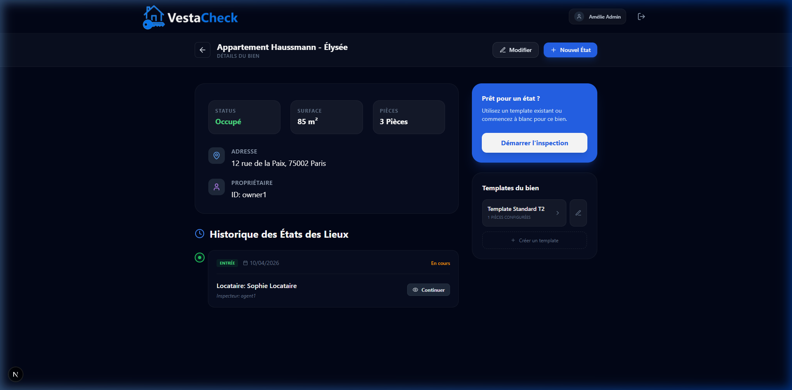

<p align="center">
  
</p>

# VestaCheck - Gestion des États des Lieux

**VestaCheck** est une application web moderne conçue pour transformer la gestion des états des lieux immobiliers. Alliant une interface premium à une robustesse technique, elle permet aux agents immobiliers et propriétaires de réaliser des inspections précises, visuelles et sécurisées.

---

## 📸 Aperçu de l'Application

### Dashboard & Notifications
L'interface utilise un système de notifications "Glassmorphism" (Sonner) pour un feedback utilisateur élégant et non intrusif.


### Gestion du Parc & Templates
Chaque bien dispose de ses propres modèles de configuration (templates) éditables pour accélérer les futurs états des lieux.


### Rapports PDF Haute Définition
Génération de documents officiels avec en-têtes répétables, pagination automatique et rendu net (Scale x3).


---

## 🔥 Fonctionnalités Avancées

- 🏠 **Hiérarchie Structurée** : Organisation par Propriété > Inspection > Pièce > Élément.
- 📋 **Gestion de Templates** : Création, nommage et édition de modèles par bien (ex: "T2 Standard", "Meublé Luxe").
- 📄 **Moteur PDF HD** : Exportation haute fidélité utilisant un système de capture par couches pour une netteté maximale.
- 🔔 **Notifications Globales** : Système de toast `Sonner` intégré avec support du Dark Mode.
- ✍️ **Signature Électronique** : Signature tactile sécurisée avec verrouillage automatique du rapport.
- 🔐 **Rôles & Permissions** : Accès segmentés (Administrateur, Agent, Propriétaire).
- 📡 **Mode Hors-Ligne** : Optimistic UI permettant la saisie fluide même sans connexion réseau.

---

## 🛠️ Stack Technique

### Frontend & Framework
- **React 19 / Next.js 15 (App Router)** : Performance et rendu hybride (SSR/CSR).
- **Tailwind CSS** : Design system sur-mesure et composants "Glassmorphism".
- **Lucide React** : Iconographie vectorielle.
- **Sonner** : Moteur de notifications interactives.

### Logique & Data
- **TypeScript** : Typage strict (Schéma `InspectionReport` et `PropertyTemplate`).
- **Zustand** : Store global persistant (localStorage) pour le mode déconnecté.
- **NextAuth.js v5** : Authentification sécurisée.
- **React Hook Form + Zod** : Moteur de validation de schémas complexe.

### Moteur de Document
- **jsPDF / html2canvas** : Génération de PDF HD avec gestion dynamique des sauts de page.
- **React Signature Canvas** : Capture de signatures manuscrites.

---

## 🚀 Installation & Lancement

```bash
# Installation des dépendances
npm install

# Lancement en mode développement
npm run dev
```

---

## 📐 Structure de Données (Authority Schema)

Le projet suit scrupuleusement une interface TypeScript unique pour garantir l'intégrité des rapports :

```typescript
export interface InspectionReport {
  id: string;
  propertyAddress: string;
  date: string;
  type: 'Entrée' | 'Sortie';
  ownerId: string;
  inspectorId: string;
  tenantName: string;
  rooms: Room[];
  isFinalized: boolean;
}
```

---

<p align="center">
  Développé avec ❤️ par l'équipe VestaCheck Architecture.
</p>