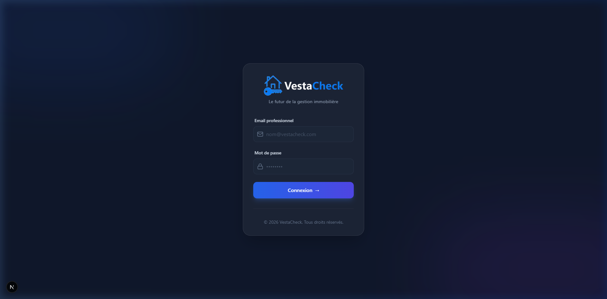
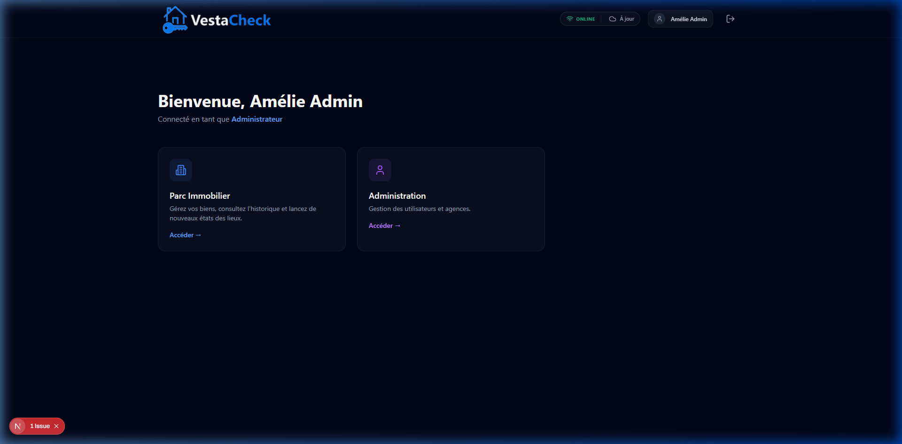
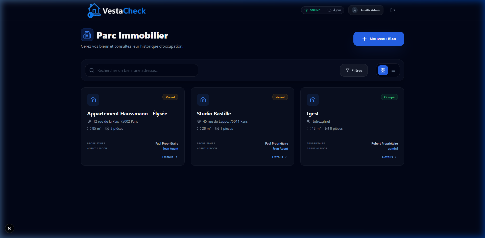
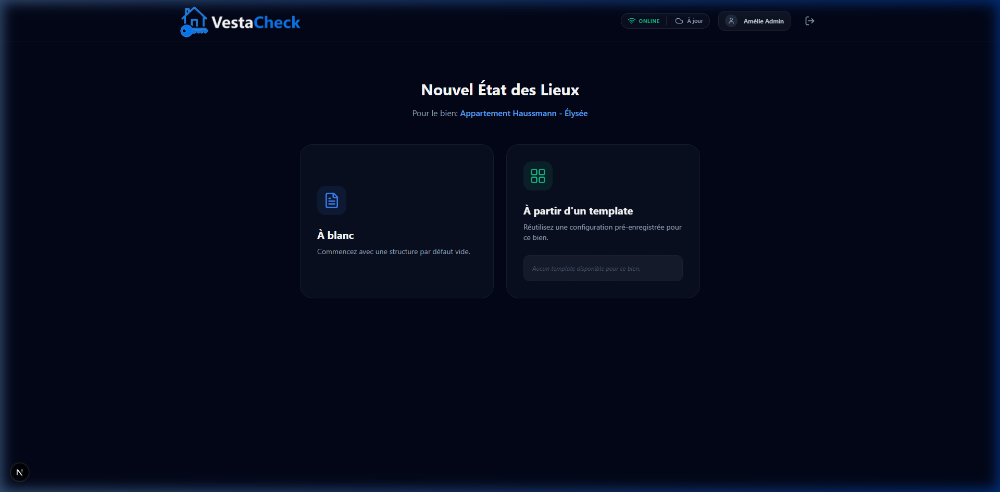
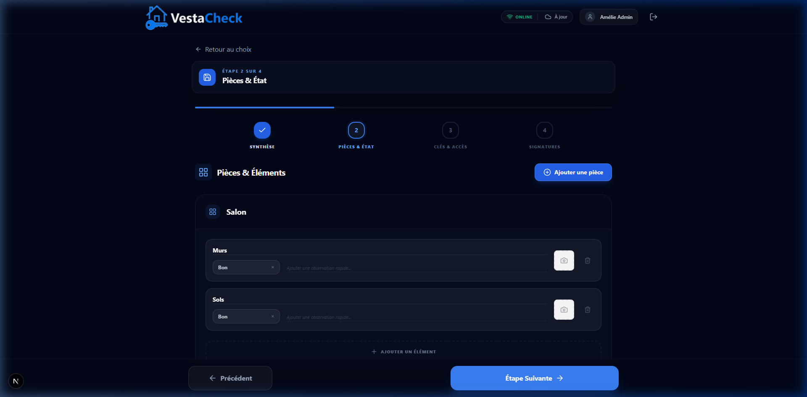
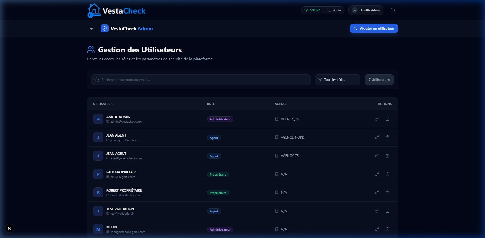

<p align="center">
  
</p>

# VestaCheck - Gestion des États des Lieux Numériques

**VestaCheck** est une plateforme professionnelle conçue pour moderniser la réalisation des états des lieux immobiliers. Grâce à son architecture **Offline-First**, elle garantit une fluidité totale sur le terrain, même sans réseau.

---

## 📸 Aperçu de la Plateforme (v2)

### Authentification & Sécurité
Accès sécurisé pour les Administrateurs, Agents et Propriétaires. Les mots de passe sont désormais hachés avec **bcrypt**.


### Dashboard & Connectivité
Suivi en temps réel des inspections et indicateur de synchronisation intelligent.


### Gestion du Parc Immobilier
Vue interactive des biens avec filtres dynamiques (Disponibilité, Type) et mode Grille/Liste.


### Parcours d'Inspection Dynamique
Interface simplifiée par étapes (Stepper) pour une saisie rapide et sans erreur.
| Étape 1 : Informations Locataire | Étape 2 : Saisie des Pièces |
| :---: | :---: |
|  |  |

---

## 🔥 Fonctionnalités Maîtresses

- 📡 **Offline-First (Dexie.js)** : Saisie locale ultra-rapide avec synchronisation automatique lors de la reconnexion.
- 📋 **Templates de Biens** : Créez et réutilisez des modèles de pièces pour chaque logement afin de gagner du temps.
- 🔐 **Sécurité Avancée** : Authentification NextAuth v5 avec hachage bcrypt des données sensibles.
- 📄 **Moteur PDF HD** : Génération de rapports officiels avec en-têtes répétables et rendu haute fidélité.
- ✍️ **Signature Tactile** : Signature électronique intégrée pour le locataire et l'agent.
- 👥 **Console Admin** : Gestion complète des utilisateurs, rôles et agences partenaires.


---

## 🛠️ Stack Technique Premium

> [!NOTE]
> Le projet utilise les toutes dernières versions de React et Next.js pour garantir performance et maintenabilité.

- **Frontend** : React 19, Next.js 15, Tailwind CSS.
- **Persistance** : Dexie.js (IndexedDB) + LocalStorage.
- **Logique** : Zustand (State Management), React Hook Form, Zod.
- **Auth** : NextAuth.js v5.
- **Assets** : Lucide React (Icons), Sonner (Toasts).

---

## 🚀 Installation Rapide

```bash
# 1. Cloner et installer
npm install

# 2. Configurer les variables d'environnement (.env.local)
NEXTAUTH_SECRET="votre_secret_ici"

# 3. Lancer le serveur de développement
npm run dev
```

---

## 📐 Autorité du Schéma de Données

Le projet respecte une structure métier rigoureuse définie dans `types/index.ts` :
`Propriété > Inspection > Pièce > Élément > État + Photos`.

---

<p align="center">
  Développé avec ❤️ par l'équipe VestaCheck Architecture.
</p>