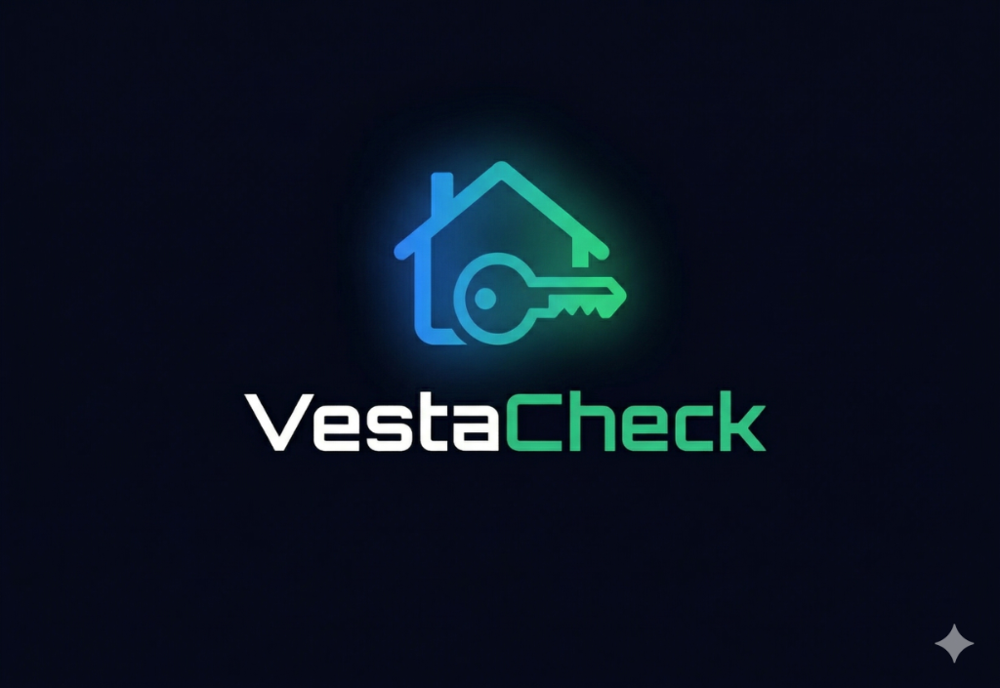
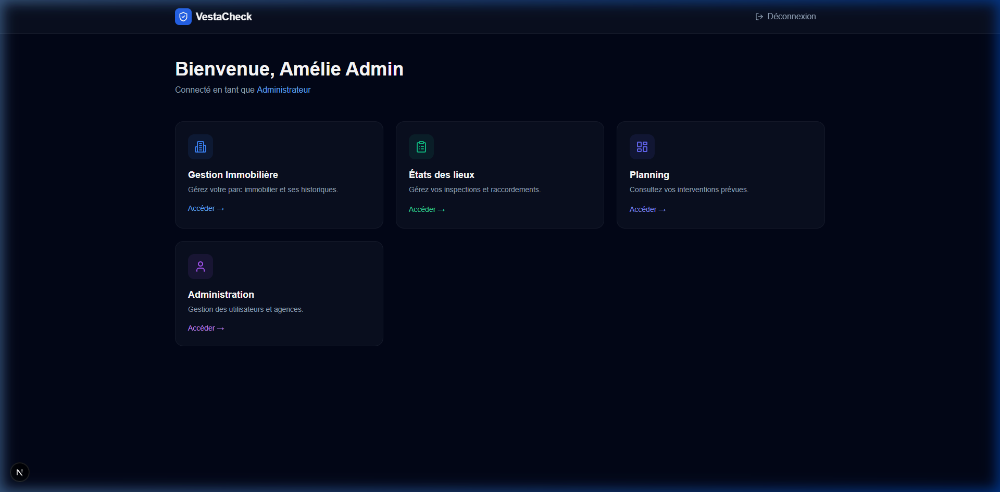
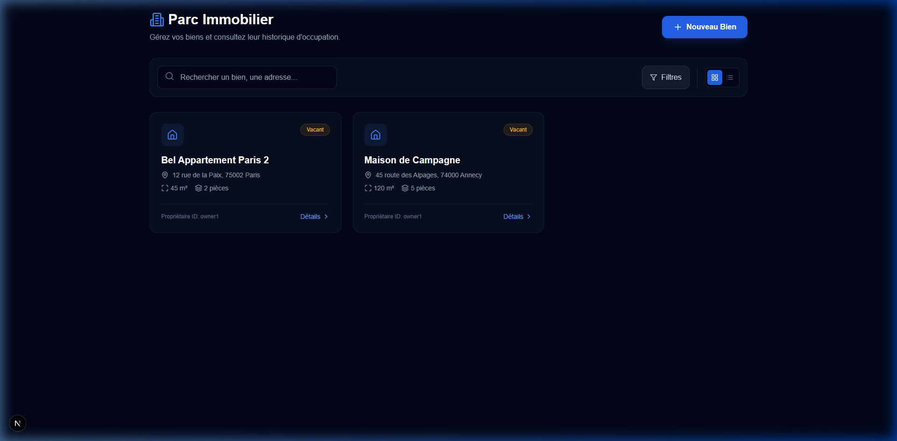
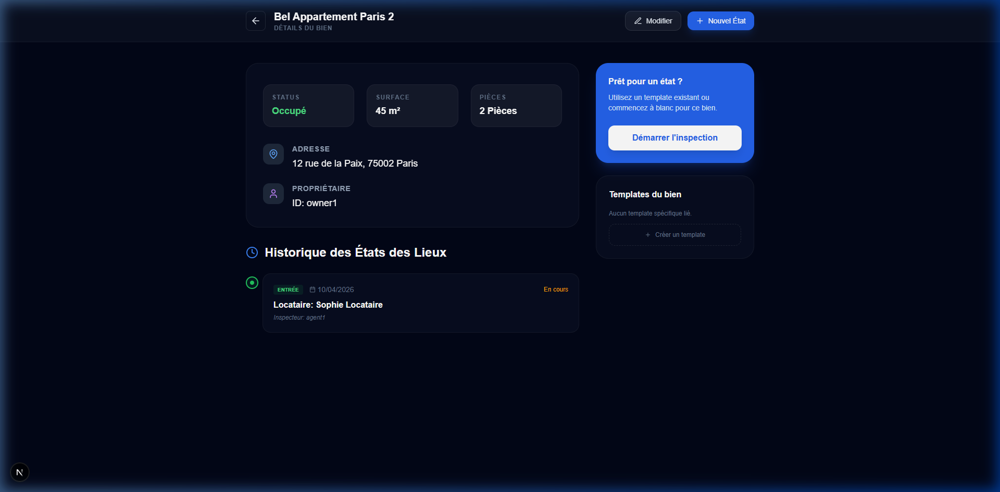
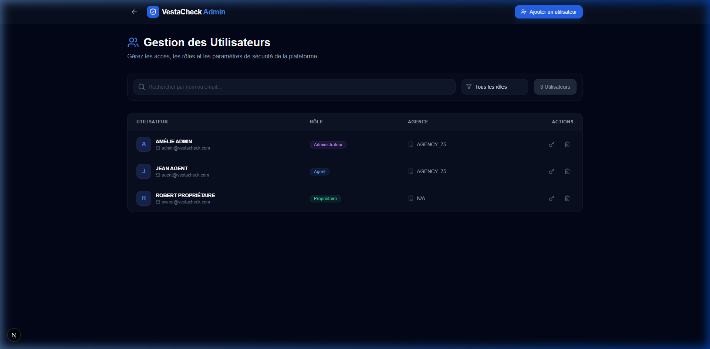

<p align="center">
  
</p>

# VestaCheck - Gestion des États des Lieux

**VestaCheck** est une application web moderne conçue pour transformer la gestion des états des lieux immobiliers. Alliant une interface premium à une robustesse technique, elle permet aux agents immobiliers et propriétaires de réaliser des inspections précises, visuelles et sécurisées.

---

## 📸 Aperçu de l'Application

### Dashboard Principal
L'interface centrale offre un accès rapide à la gestion immobilière, aux inspections en cours et à l'administration du personnel.


### Gestion du Parc Immobilier
Visualisez vos biens et accédez à l'historique complet de chaque logement.


### États des Lieux Multi-Section
Un historique clair pour chaque propriété, permettant de comparer les états d'entrée et de sortie.


### Administration & Rôles
Gestion fine des accès pour les Administrateurs, Agents et Propriétaires.


---

## 🔥 Fonctionnalités Clés

- 🏠 **Hiérarchie Structurée** : Organisation par Propriété > Inspection > Pièce > Élément.
- 📸 **Documentation Visuelle** : Prise de photos en temps réel pour justifier l'état de chaque élément.
- ✍️ **Signature Électronique** : Signature tactile directement sur l'interface pour validation immédiate.
- 📄 **Génération PDF** : Export instantané de rapports professionnels et certifiés.
- 🔐 **Rôles & Permissions** : 
  - **Administrateur** : Vue d'ensemble et gestion des agences.
  - **Agent** : Création et réalisation des inspections sur le terrain.
  - **Propriétaire** : Accès en lecture seule à ses biens et rapports.
- 📡 **Mode Hors-Ligne** : Optimistic UI permettant la saisie fluide même sans connexion réseau.

---

## 🛠️ Stack Technique

### Frontend & Framework
- **React 19 / Next.js 15 (App Router)** : Performance et SEO optimisés.
- **Tailwind CSS** : Design "Glassmorphism" et interface responsive.
- **Lucide React** : Iconographie moderne.

### Logique & Data
- **TypeScript** : Typage strict pour une robustesse maximale (Schéma `InspectionReport`).
- **Zustand** : Gestion d'état global et persistance locale.
- **NextAuth.js v5** : Authentification sécurisée et gestion de sessions.
- **React Hook Form + Zod** : Validation de formulaires complexe.

### Outils Spécialisés
- **jsPDF / html2canvas** : Moteur de génération de documents PDF.
- **React Signature Canvas** : Module de signature électronique.

---

## 🚀 Installation & Lancement

```bash
# Installation des dépendances
npm install

# Lancement en mode développement
npm run dev
```

L'application sera accessible sur [http://localhost:3000](http://localhost:3000).

---

## 📐 Structure de Données (Authority Schema)

Le projet suit scrupuleusement une interface TypeScript unique pour garantir l'intégrité des rapports :

```typescript
export interface InspectionReport {
  id: string;
  propertyAddress: string;
  date: string;
  type: 'Entrée' | 'Sortie';
  ownerId: string;
  inspectorId: string;
  tenantName: string;
  rooms: Room[];
  isFinalized: boolean;
}
```

---

<p align="center">
  Développé avec ❤️ par l'équipe VestaCheck Architecture.
</p>