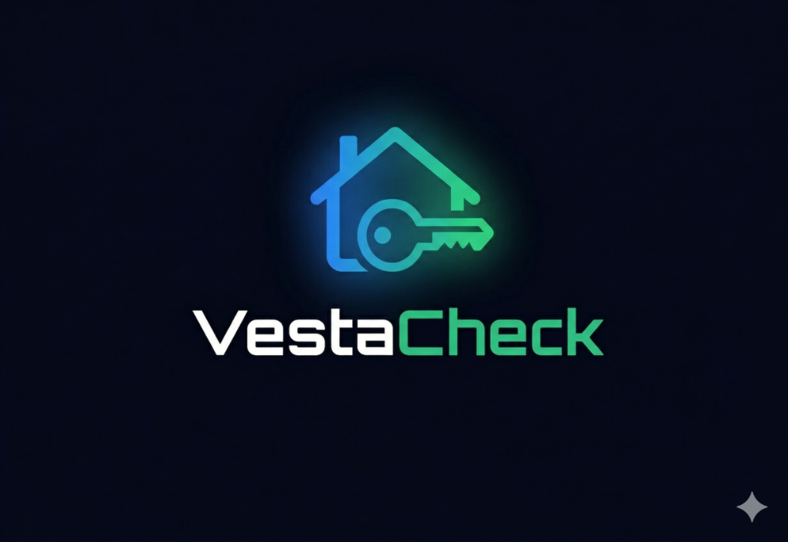
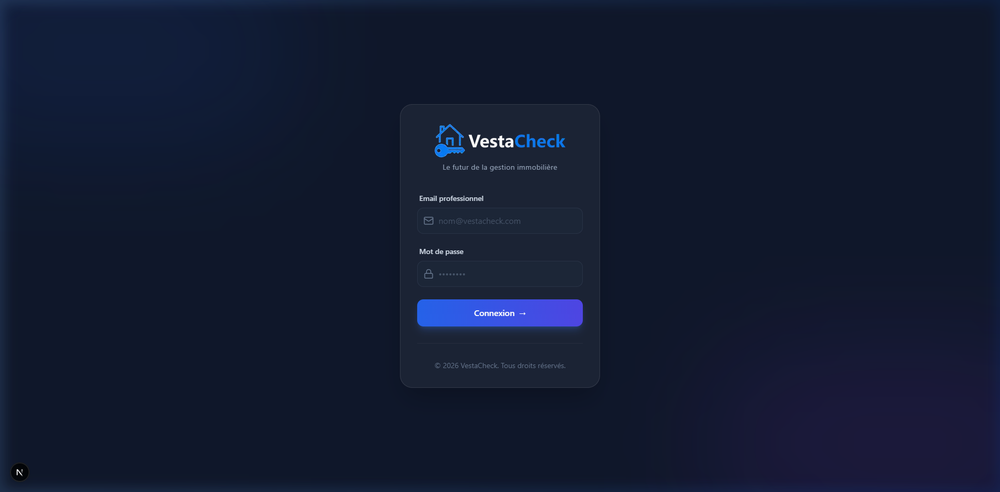
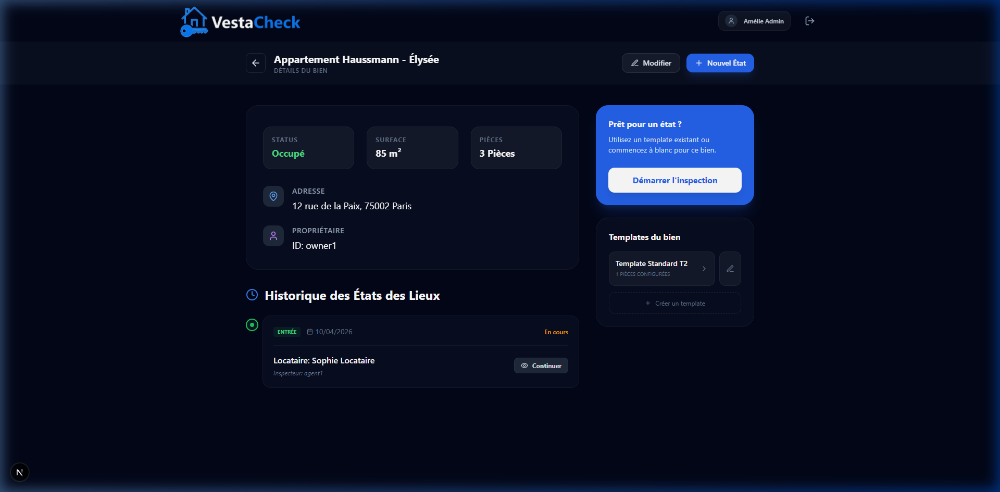
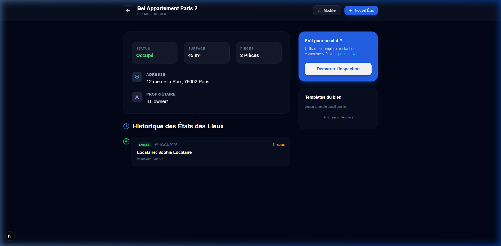

<p align="center">
  
</p>

# VestaCheck - Gestion des États des Lieux Numériques

**VestaCheck** est une plateforme professionnelle conçue pour moderniser la réalisation des états des lieux immobiliers. Grâce à son architecture **Offline-First**, elle garantit une fluidité totale sur le terrain, même sans réseau.

---

## 📸 Aperçu de la Plateforme

### Authentification & Sécurité
Accès sécurisé pour les Administrateurs, Agents et Propriétaires. Les mots de passe sont désormais hachés avec **bcrypt**.


### Dashboard & Notifications
L'interface utilise un système de notifications "Glassmorphism" (Sonner) pour un feedback utilisateur élégant et non intrusif.


### Gestion du Parc & Templates
Chaque bien dispose de ses propres modèles de configuration (templates) éditables pour accélérer les futurs états des lieux.


### Rapports PDF Haute Définition
Génération de documents officiels avec en-têtes répétables, pagination automatique et rendu net (Scale x3).


---

## 🔥 Fonctionnalités Maîtresses

- 📡 **Offline-First (Dexie.js)** : Saisie locale ultra-rapide avec synchronisation automatique lors de la reconnexion.
- 📋 **Templates de Biens** : Créez, nommez et éditez des modèles par bien (ex: "T2 Standard") pour gagner du temps.
- 🔐 **Sécurité Avancée** : Authentification NextAuth v5 avec hachage bcrypt des données sensibles.
- 📄 **Moteur PDF HD** : Exportation haute fidélité avec en-têtes répétables et rendu haute résolution.
- ✍️ **Signature Tactile** : Signature électronique sécurisée pour le locataire et l'agent avec verrouillage du rapport.
- 🔔 **Notifications Globales** : Système de feedback interactif `Sonner` intégré.
- 👥 **Console Admin** : Gestion complète des utilisateurs, rôles (Admin, Agent, Proprio) et agences.

---

## 🛠️ Stack Technique Premium

> [!NOTE]
> Le projet utilise les toutes dernières versions de React et Next.js pour garantir performance et maintenabilité.

- **Frontend** : React 19, Next.js 15 (App Router), Tailwind CSS.
- **Logique** : Zustand (State Management), React Hook Form, Zod.
- **Persistance** : Dexie.js (IndexedDB) pour le mode Offline-First.
- **Auth** : NextAuth.js v5.
- **Moteur Document** : jsPDF / html2canvas (Rendu HD, gestion dynamique des sauts de page).
- **Signature** : React Signature Canvas.
- **Assets** : Lucide React (Icons), Sonner (Toasts).

---

## 🚀 Installation Rapide

```bash
# 1. Cloner et installer
npm install

# 2. Configurer les variables d'environnement (.env.local)
NEXTAUTH_SECRET="votre_secret_ici"

# 3. Lancer le serveur de développement
npm run dev
```

---

## 📐 Autorité du Schéma de Données

Le projet respecte une structure métier rigoureuse définie dans `types/index.ts` :
`Propriété > Inspection > Pièce > Élément > État + Photos`.

---

<p align="center">
  Développé avec ❤️ par l'équipe VestaCheck Architecture.
</p>